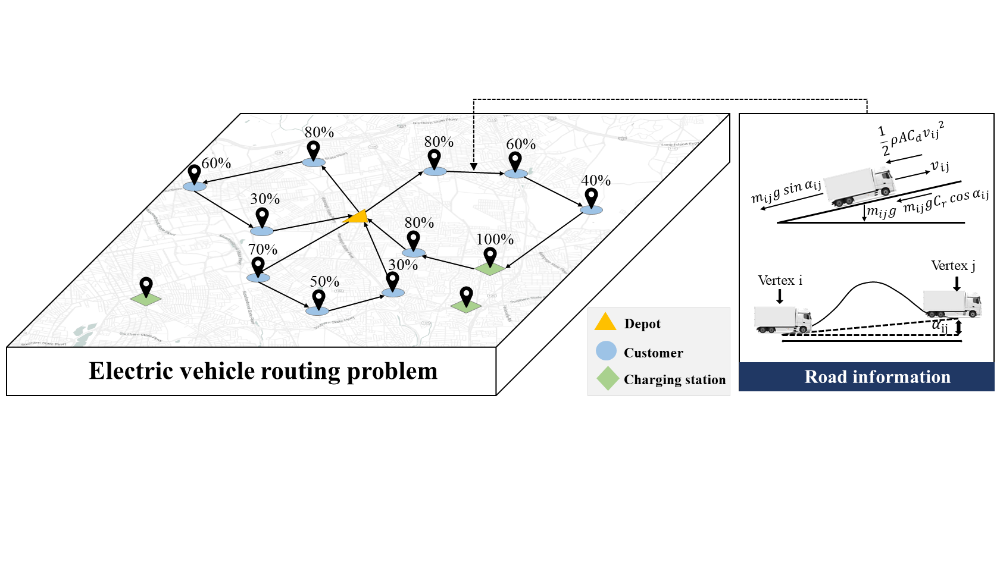

# DRL-Energy-optimal-Routing-for-Electric-Vehicles

## Paper Information

**Title**: Energy-optimal Routing for Electric Vehicles using Deep Reinforcement Learning with Transformer

This paper proposes the use of deep reinforcement learning to solve the nonlinear Electric Vehicle Routing Problem (EVRP) and redesigns the policy network.

## Dependencies

This project depends on the following packages:

- Python (>=3.7)
- PyTorch (= 1.21.1)
- numpy
- tqdm
- Matplotlib

Please make sure these packages are installed in your environment.
